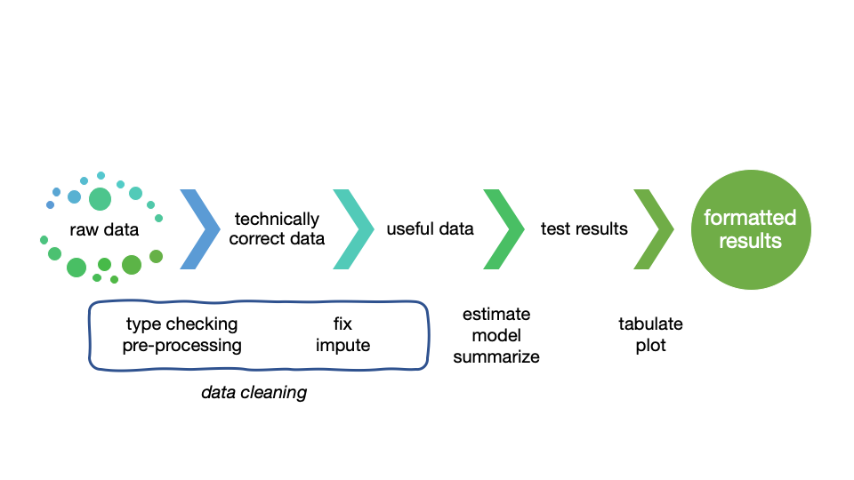
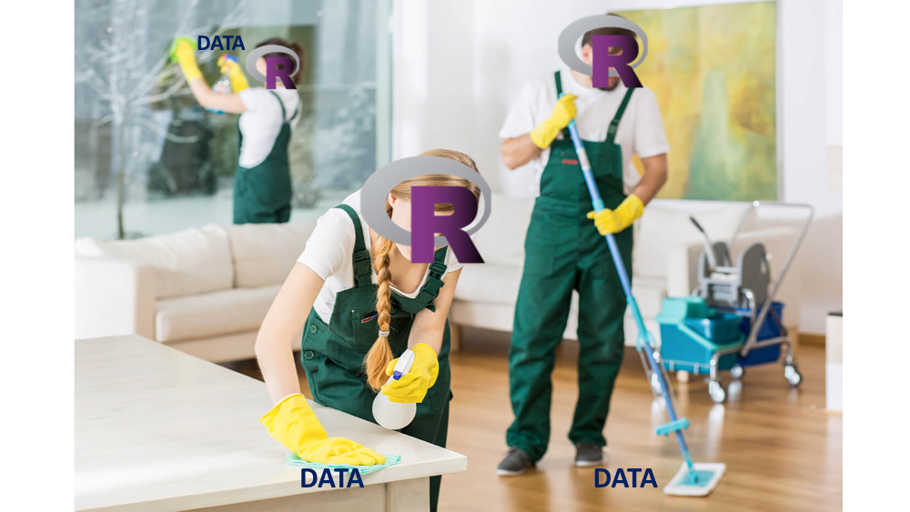

```{r setup, include=FALSE}
knitr::opts_chunk$set(echo = TRUE)
```

## Introduction to part 1

As the saying goes, data scientists spend 80% of their time cleaning data... and the other 20% complaining about data cleaning. 


In this workshop, participants will learn how to use R packages to ingest, clean, and reshape data.

## What we are doing

- We will introduce useful R packages and learned wisdom on how to approach data wrangling in general
- We will take on a series of challenges 
- We will discuss the various solutions that were arrived at by different participants 
- We will discuss how to ask coding questions effectively 

## The data value chain

{width=90%}


## Useful packages

+ tidyverse: readr, dplyr, tidyr, stringr, purrr
+ janitor
+ skimr
+ DataExplorer (requires later R version)


## Getting the @#$@! Data into R

What if the raw data cannot even get into R?

## What is tidy data?

https://r4ds.had.co.nz/tidy-data.html

There are three interrelated rules which make a dataset tidy:

1. Each variable must have its own column.
1. Each observation must have its own row.
1. Each value must have its own cell.

Usually datasets are organized to make *data entry* easy, but not to make *data analysis* easy.

## Example non-tidy data
https://r4ds.had.co.nz/tidy-data.html

```{r eval=FALSE}
table2
#> # A tibble: 12 x 4
#>   country      year type           count
#>   <chr>       <int> <chr>          <int>
#> 1 Afghanistan  1999 cases            745
#> 2 Afghanistan  1999 population  19987071
#> 3 Afghanistan  2000 cases           2666
#> 4 Afghanistan  2000 population  20595360
#> 5 Brazil       1999 cases          37737
#> 6 Brazil       1999 population 172006362
#> # … with 6 more rows
```


## Example tidy data
https://r4ds.had.co.nz/tidy-data.html

```{r eval=FALSE}
table1
#> # A tibble: 6 x 4
#>   country      year  cases population
#>   <chr>       <int>  <int>      <int>
#> 1 Afghanistan  1999    745   19987071
#> 2 Afghanistan  2000   2666   20595360
#> 3 Brazil       1999  37737  172006362
#> 4 Brazil       2000  80488  174504898
#> 5 China        1999 212258 1272915272
#> 6 China        2000 213766 1280428583
```

## Let's take on some challenges

1. Ingest rectangular data - readr vs. base R vs. data.table
2. Inspect the data - dplyr, skimr, DataExplorer
3. Fix some dirty fields - dplyr, tidyr, janitor
4. Pivoting - RIP to tidyr::gather(), tidyr::spread()
5. Pivoting - new tidyr `pivot_` functions
6. Ingest other data - JSON


## Go to RStudioCloud

LINK HERE

Go to exercises/challenge.Rmd

We will work on three Philadelphia datasets: locations of farmers markets, locations of Wawas, and real estate prices

## Time to share

{width=60%}

## How to ask better questions

a reprex is a *repr*oducible *ex*ample.

https://github.com/tidyverse/reprex


## Recommended reading

- https://learniningwithsckinta.netlify.com/post/2019-10-22_data_wrangling/
- https://www.tidyverse.org
- https://github.com/rstudio/cheatsheets
- https://cran.r-project.org/doc/contrib/de_Jonge+van_der_Loo-Introduction_to_data_cleaning_with_R.pdf
- https://resources.rstudio.com/rstudio-conf-2020/lightning-talk-maya-gans
